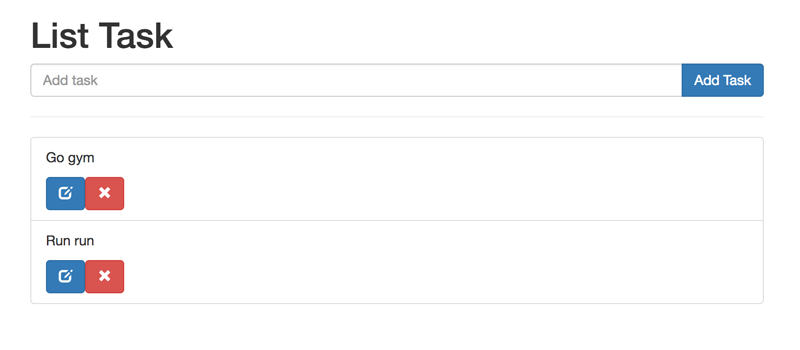

# Building a task list step by step (with mongoose)
Note: We asume we have installed node, mongoDB and nodemon in our computer. Otherwise, install this packages.

https://nodejs.org/es/

https://nodemon.io/

https://www.mongodb.com/

## 1. Components preparation

### 1.1. Create the directory into terminal

`mkdir task_mongoose`

### 1.2. Go to the directory

`cd task_mongoose`

### 1.3. Create the package.json and the bower.json files

`npm init -y`

`bower init`

In order to avoid record your dependencies into the git repo create the .gitignore file:

`touch .gitignore`

### 1.4. Install express, mongoose and bower

`npm install express --save`

`npm install mongoose --save`

`npm install bower --save`

At this point, create the file .bowerrc to indicate to bower where save components.

`touch .bowerrc`

Into this hide file write the route in this way:

```
{
  "directory": "public/bower_components"
}
```


### 1.5. Install boostrap and jQuery,

`bower install bootstrap --save`

Usually bootstrap install jQuery by default, in other case:

`bower install jquery --save`

### 1.6. Install pug and body parser

`npm install pug --save`

`npm install body-parser --save`

### 1.7. Create the project structure.

Into one folder called server (/server/) 

`mkdir server`

We create this structure by terminal commands.

* routes/route - 'route' will be the name we can choose to of our components folder. We are going to substitute oute by 
* routes/route/handlers - code and functionality to be shared by different parts of the project. it includes Express middlewares which process the incoming requests before handling them down to the routes
* models/ – represents data, implements business logic and handles storage
* public/ – contains all static files like images, styles and javascript
* * public/js/main.js -  route and file with the ajax requests.
* views/ – provides templates which are rendered and served by your routes
* views/includes – provides sub-templates
* app.js – initializes the app and glues everything together

if public is not created by default after installing bower we must create it:

### 1.8. Create the Model Schema Structure.

Into the models folder we creaate the model file. It could be similar to this combination of three pieces.

* Piece one. We requiere moongose in order to manage the data base.

```
const mongoose = require('mongoose')
const Schema = mongoose.Schema
```

* Piece two. We built the schema of the object:

```
var toDo_Schema = new Schema({
    task: String,
    dateOfCreation: {
        type: Number,
        default: +new Date
    },
    dateOfUpdate: Number,
    completed: {
        type: Boolean, 
        default: false
     }
})
```

* Piece three. We exports this model schema that we are going to require at each piece of code we need to use it.

```
const toDo = mongoose.model('toDo', toDo_Schema);
module.exports = toDo

```


## 2. Testing the connection

### 2.1. Createing the app.js into the server folder

`touch tapp.js`

In this file we are going to require the modules we will need

### 2.2. Requiring modules

```
const express = require('express')
const bodyParser = require('body-parser')
const mongoose = require('mongoose')
const path = require('path')

https://nodemon.io/
```


### 2.3. Indicating the port to the mongoose data base

```
const urlDB = 'mongodb://localhost:27017/test'
mongoose.connect(urlDB)
```

### 2.4. Creating a instance of express

`const app = express()`

### 2.5. Indicating the port to connect the server

```
const PORT = 3000
app.listen(PORT)
console.log(`Listening on PORT ${PORT}`)
```

### 2.6. Testing in terminal

We desplace to the server folder from terminal and run

`nodemon app` in order to test the local host.

The response from terminal will be: 'Listening on PORT 3000' as we console.log whit the code of the 2.5 point

### 2.7. Testing in mongo shell

Whith this command into termninal we can run the 'deamon' of mongoDb

`mongod --dbpath ~/data/db`

'~/data/db' ==>  this route must be the by default path when you install mongoDB.

then in other terminal window run mongo

`mongo`

We can test in brower if we create a module wiht a get

Then we define into the folder 'handlers' of 'tasks' a 'getAllTask.js' file with this content

***One: require the model schema of our database:***

`const toDo = require('../../../models/toDo')`

***Four: we create de function with the text that will check the connection***

```
const toDo = require('../../../models/toDo')

function getAllTasks(req, res) {
    res.send('We are going to use this file to call the database!!!')
}
```


***Three: we exports this code to the index file***

`module.exports = listTask`

***Four: we create de function will print the test that will check the conection***

We create an 'index.js' file and we require whit it 'express' and the 'getAllTasks' file 

```
const express = require('express')
const router = express.Router()

const getAllTasks = require('./handlers/getAllTasks')

router.get('/', getAllTasks)

module.exports = router
```


***Five: We inlcude this routes into 'app.js'***

`const routerTasks = require('./routes/tasks')`

`app.use('/tasks', routerTasks)`
`

***Six: We run localhost:3000/tasks'***

Run this url: localhost:3000/tasks in our browser should return:

'We are going to use this file to call the database!!!

At that pint we made the arquitecture. The nesxt step is coding the application.

## 3. Adding CRUD to our app.

### 3.1. Creating files:

Now is time to create functionality with the data base, and for that reason we need to add into the 'app.js' file the **body-parsers** to deal with json files:

```
app.use(bodyParser.urlencoded({ extended: false }))
app.use(bodyParser.json())
```


The first step is create the CRUD, word that stands for :create, read, update, and delete. Each function will be into a file.

We are going to include into the ***tasks*** (plural) folder the two files with the 'create' and 'read' functions . The other functions delete and update goes to be into the two files and be stored in a named ***task*** (singular) folder. It also means that the url path goes to be ***/tasks*** and ***/task***.

Create and read will be built using Get and Post methods in native form.
Update and remove will be done with the Put and Delete methods with jQuery.

All files will have:

***A header:*** to require the toDo Schema.

`const toDo = require('../../../models/toDo')`

***A footer*** with a command to export the function:

`module.exports = functionName`
Where functionName will be replaced by the function name (obviously, rigth?)

In the middle of the footer will introduce the functions.

Furthermore we nedd a .js file to manage the ajax request in order to use the PUT and the DELETE methos needed to make our magic.

This content goes to be gadering into the main.js file.

### 3.2. Function 'ADD', methos POST':

This is the function 'addTask' to create elements into the data base:

```
function addTask (req, res) {
    const { task, dateOfUpdate, completed } = req.body
    const newToDo = new toDo({ task, dateOfUpdate: +new Date(), completed })
    newToDo.save()
        .then(msg => {
         res.redirect('/tasks')
            res.json(msg)
        })
        .catch(err => {
            res.json(err)
        })
}
```


**Explanation:**
 We capture for the request of the user {task, dateOfUpdate, completed} and we assign it as values the toDo {task, dateOfUpdate, completed} as the object newToDo and we respond with a json format:

```
 {
   "task": "task",
   "dateOfUpdate": "dateOfUpdate",
   "completed": "completed"
 } 
```


**Add routes:**

Into the file index of the tasks folder we should include:
```
const addTask= require('./handlers/addTask')
router.post('/', addTask)
```

Into the app.js we add:

```
const routerTasks = require('./routes/tasks')
app.use('/task', routerTasks)
```

Attention ==>>  notice ths 's' on tasks.

**Check:**
After including this function into a file 'addTask.js' file including the header and the footer where we changed 'functionName' by 'addTask' we can use the terminal with this 'curl' command to check if it works.

```
curl -X POST --data "task=Buy tickets" localhost:3000/tasks
curl -X POST --data "Task=Go gym&completed=true" localhost:3000/tasks
```


### 3.3. Function 'READ', method GET:

Into the file **getAllTasks.js** we created before, we need subtite this code:

```
// function getAllTasks(req, res) {
//     res.send('We are going to use this file to call the database!!!')
// }
```

For this one and save the file:

```
function getAllTasks(req, res) {
    toDo.find()
        .then(toDos => {
            res.json(toDos)
        })
}
```


**Explanation:**
 We respond the req uest of the user finding all the elements of the collection we just created and showing them to the user nas jsan file.

**Add routes:**
In this case we do not need to add routes because we did it before: at the  Paragraph: 2.7. (Five action) of this text.

**Check:**
After including this function into a file 'getAllTask.js' file including the header and the footer where we changed 'functionName' by 'getAllTask' we can use the terminal with this 'curl' command to check if it works.

```
curl localhost:3000/tasks
```


### 3.3. Function 'DELETE, method DELETE

For this one, we create this function: removeById(). After that we add to the removeById.js file (with the header and footer we talk before).

```
function removeById(req, res) {
    const { id } = req.params
    toDo.findByIdAndRemove(id)
        .then(msg => {
            res.json(msg)
        })
        .catch(err => {
            res.json(err)
        })
}
```

**The code for the main.js file:**

```
$('.list-tasks .remove').on('click', function(e) {
  e.preventDefault();
  const $thisElement = $(this)
  const url = $thisElement.attr("href")
  const method = 'DELETE'
  $.ajax({ url, method })
    .done ( response => {
      $thisElement.parents('.list-group-item').remove()
    })
    .fail( () =>  alert("Try removing again champ!") );
})
```


**Explanation:**
 We respond the request of the user taking the ID of the url and finding the element of the database with this id. When we matchs both we delete the elemetn an renew the toDo collection.

 If some error occurs we respond with the 'res.jason(err)'

**Add routes:**
We need to create a new and different index.js file into the ***task*** (in singular) folder.

We should include:

```
const removeById = require('./handlers/removeById')
router.delete('/:id', removeById )
```

In the app.js we include:

```
const routerTask = require('./routes/task')
app.use('/task', routerTask)
```

**Check:**
After including this function into a file 'removeById.js' file including the header and the footer where we changed 'functionName' by 'removeById' we can use the terminal with this 'curl' command to check if it works.

```
curl -X DELETE localhost:3000/task/592753c5e48c3613671ee7e1
```

notice as the number 592753c5e48c3613671ee7e1 is the ID we collect form req.params,

### 3.4. Function 'UPDATE', method: PUT:

For this case, we create this function: rupdateById. After that we add it to the updateById.js file (with the header and footer we talk before).


```
function updateById (req,res) {

  const { id } = req.params
  const { task, dateOfUpdate, completed } = req.body

  const updateData = {}
  
  if (task) updateData.task = task
  if (dateOfUpdate) updateData.dateOfUpdate = +new Date()
  if (completed) updateData.completed = completed

  toDo.findByIdAndUpdate(id, updateData)
    .then( msg => {
      res.json(msg)
    })
    .catch( err => {
      res.json(err)
    })
}
```

**The code for the main.js file:**

```
  $.ajax({
    url,
    method,
    data: { editedValue }
  })
  .done( response => {
    $thisElement
      .siblings("p")
        .text(editedValue)
        .removeClass("hidden")
        .end()
      .find("input")
        .addClass("hidden")
    toastr.success(response)
  })
  .fail( () =>  alert("Try removing again champ!") );
})

$(".edit-form").on("submit", function(e) {
  e.preventDefault();

  const $thisElement = $(this)
  const url = $thisElement.attr("action")
  const editedValue = $thisElement.find('input').val()
  const method = 'PUT'

  $.ajax({
    url,
    method,
    data: { editedValue }
  })
  .done( response => {
    $thisElement
      .siblings("p")
        .text(editedValue)
        .removeClass("hidden")
        .end()
      .find("input")
        .addClass("hidden")
    toastr.success(response)
  })
  .fail( () =>  alert("Try removing again champ!") );
})
```

**Explanation:**
 We respond the request of the user taking the ID of the url and finding the element of the database with this id. When we matchs both we delete the elemetn an renew the toDo collection.

 If some error occurs we respond with the 'res.jason(err)'

**Add routes:**
We need to create a new and different index.js file into the ***task*** (in singular) folder.

We should include:

```
const updateById = require('./handlers/updateById')
router.put('/:id', updateById)
```

In the app.js we include:

```
const routerTask = require('./routes/task')
app.use('/task', routerTask)
```

**Check:**
After including this function into a file 'updateById.js' file including the header and the footer where we changed 'functionName' by 'updateById' we can use the terminal with this 'curl' command to check if it works.

```
curl -X PUT --data "task=Visit Ringo Star house&completed=true" localhost:3000/task/592753da4b3956137da85a3b
```

notice as the number 592753da4b3956137da85a3b is the ID we collect form req.params.

## 4. Printing with 'pug' into the browser.

To achive this challenge we need:

* A. Create the .pug files and save them into the views folder.

* B. Mofdify the CRUD functions to print the content of the database using the pug fiules into the window browser.

* C. Accesing from app.js to Path and Pug


***The index.pug file:***

```
extends layout

block content
  .container
    .row
      .col-md-8.col-md-offset-2
          h1 List Task
          form(action='/tasks', method='POST')
            .input-group
              input.form-control.add-todo(name="task", type='text', placeholder='Add task', autofocus)
              span.input-group-btn
                button#checkAll.btn.btn-primary Add Task
          hr
          ul#sortable.list-unstyled.list-group.list-tasks
            each toDo in toDos
              li.list-group-item
                .content
                  p #{toDo.task}
                  form.edit-form(action=`/task/${toDo.task}`)
                   input.input-lg.hidden(name='edited-value', value=toDo.task)
                .edition
                   a.btn.btn-primary.edit
                     i.glyphicon.glyphicon-edit
                   a.btn.btn-danger.remove(href=`/task/${toDo._id}`)
                     i.glyphicon.glyphicon-remove
```


**Explanation:**

.......
.......
.......

***The layout.pug file:***

```
doctype html
html(lang='en')
  head
    meta(charset='UTF-8')
    title Document
    include includes/styles.pug
  body
    block content

    include includes/scripts.pug
```


**The code for the main.js file:**

```
$('.list-tasks .edit').on('click', function(e) {
  e.preventDefault();
  const $thisElement = $(this)
  $thisElement
    .parents("li")
      .find("form input")
        .removeClass("hidden")
        .focus()
        .end()
      .find("p")
        .addClass("hidden")
})
```

**Explanation:**

.......
.......
.......

***The includes:***
1º scripts.pug :

```
script(src="bower_components/jquery/dist/jquery.js")
script(src="bower_components/toastr/toastr.js")
script(src="js/main.js")
```

2º styles.pug :

```
link(href="bower_components/bootstrap/dist/css/bootstrap.css", rel="stylesheet")
link(href="bower_components/toastr/toastr.css", rel="stylesheet")
link(href="css/styles.css", rel="stylesheet")
```


### 4.2. Changes into the funcions

*  Function 'getAllTask', method: PUT:

Changing:

```
res.json(toDos)
```

by:

```
res.render('index.pug', { toDos })
```

* Function 'addTask', method: PUT:

Adding this line after: `.then(msg => {`

```
res.redirect('/tasks')
```

`
### 4.3. Accesing from app.js to Path and Pug

In order to print the data and use 'pug' we use the path module and the npm package pug which deals with this king of files in order to convert them to html.

```
app.use(express.static( path.join(__dirname, '../public')  ))
app.set('view engine', 'pug')
app.set('views', path.join(__dirname, '/views'));
```

To deal with promises we need to add this methos of mongoose:

```
mongoose.Promise = Promise
```
